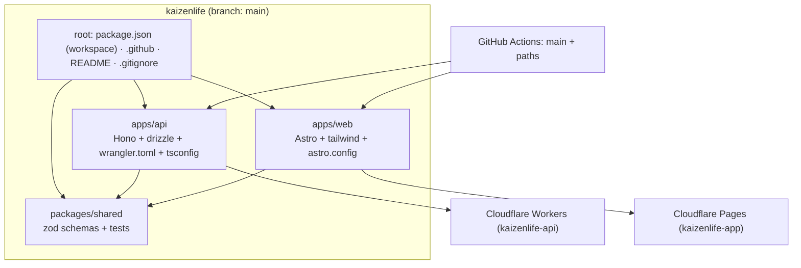

# Technical Plan: Monorepo Restructuring (branches → single `main`)

**Task ID:** restructuring-folder
**Status:** Ready for Implementation
**Based on:** /brief analysis (repo topology verified by inspection, Aug 2026)

---

## 1. System Architecture

Current: 3 diverged branches (`main` = CI skeleton; `api` = old API copy at root + workspace; `apps` = old Astro copy at root + workspace) with **identical payloads in `apps/api`, `apps/web`, `packages/shared`** — CI deploys are keyed to branch names, forcing constant `git checkout` switching and making integration testing impossible.

Target: **one working branch (`main`)** — root is a pure orchestrator; each app owns its source + configs.



## 2. Architecture Decisions (ADR)

| # | Decision | Choice | Rationale |
|---|----------|--------|-----------|
| A1 | Branch strategy | Trunk-based, all work lands on `main` | Solo dev; branch-per-app is the root cause of the drift |
| A2 | Repo layout | `apps/*` + `packages/*` (bun workspaces) | Both branches already converged here; zero code rewrite |
| A3 | App configs | `wrangler.toml`, `drizzle.config.ts`, `tsconfig.json` live **inside `apps/api/`** | One app = one folder; root stays deployable-agnostic |
| A4 | Source of truth for merge | `apps` branch = newest (`packages/shared` has `import` export + tests there); `api` branch only contributes the missing root API configs (tsconfig/wrangler) and never-newer web bits | Verified via direct folder diff (`api:apps/api` == `apps:apps/api`, `api:apps/web` == `apps:apps/web`; shared differs on `apps` by +1 export line + 2 test files) |
| A5 | CI shape | Two workflows (api / web), both on `main`, **path-filtered** | Keeps AI deploy independent; avoids matrix complexity |
| A6 | Release hook | Optional: deploy on git tags (`v*`) added later; for now push-to-`main` deploys | Matches current behavior, minimal change |
| A7 | Safety | Tags `pre-monorepo/api` + `pre-monorepo/apps` before merging | Git history retained; instant rollback refs; branches deleted only after 2 weeks |
| A8 | Git hygiene | `.gitignore` extends; `git rm --cached` tracked junk | `.astro/`, logs, `dev-*.txt`, `_verify_*.txt`, `*.db*`, `.omo/` are noise |
| A9 | Config (still-open) | `.env.example` keeps `PUBLIC_API_URL` (web build-time); prod URL set in CI | Verified current usage: web reads `PUBLIC_API_URL` at build |

## 3. Technology Stack

| Layer | Technology | Version | Rationale |
|-------|-----------|---------|-----------|
| Runtime | Bun | latest | Already used; resolves workspaces natively |
| Workspaces | bun workspaces (`apps/*`, `packages/*`) | built-in | Zero new tooling; turbo not needed at this scale |
| API | Hono + wrangler | existing | Unchanged; runs on Cloudflare Workers (D1) |
| Web | Astro + React + shadcn | existing | Unchanged; runs on Cloudflare Pages |
| Shared | TypeScript + zod | existing | Schemas shared between both apps |
| CI | GitHub Actions | existing | Two existing workflows, retargeted to `main` |

Root `package.json` (new):
```jsonc
// workspace root — no app code at root
{ "name": "kaizenlife", "private": true,
  "workspaces": ["apps/*", "packages/*"],
  "scripts": {
    "dev:api":   "bun --cwd apps/api dev",
    "dev:web":   "bun --cwd apps/web dev",
    "build:api": "bun --cwd apps/api build",
    "build:web": "bun --cwd apps/web build",
    "test":      "bun --cwd apps/web test && bun --cwd apps/api test",
    "db:push":   "bun --cwd apps/api db:push",
    "db:generate":"bun --cwd apps/api db:generate"
  } }
```

## 4. Component Design

### 4.1 Root workspace
- Purpose: orchestrate (`install`, scripts, git root, CI).
- Files after migration: `package.json`, `bun.lock`, `.env.example`, `.gitignore`, `README.md`, `PRD.md`, `CHANGELOG.md`, `specs/`, `.github/workflows/`.
- Explicitly **deleted** from root: `src/`, `public/`, `astro.config.mjs`, `tailwind.config.mjs`, `components.json`, `drizzle.config.ts`, `wrangler.toml`, `tsconfig.json` (all move into their app or drop).

### 4.2 `apps/api` (Hono)
- Source: from `apps` branch (== `api` branch, verified identical).
- Acquires on migration: `tsconfig.json` (from `api` branch root), `wrangler.toml` (adapted: `main = "src/index.ts"`, `[build] watch_dir = "src"`, D1 binding preserved), plus existing `drizzle.config.ts`.

### 4.3 `apps/web` (Astro)
- Source: from `apps` branch (== `api` branch, verified identical).
- **Divergence check required** (open risk, see §8 R2): the `apps` branch ALSO carries an older Astro copy at repo root (`src/`, etc.). Compare `apps:apps/web` vs `apps:src` + latest commits; fold missing files from the root copy into `apps/web` (prefer `apps/web` for conflicts; the newest root-only additions — e.g. changelog/status pages — must be copied over).

### 4.4 `packages/shared`
- From `apps` branch (newest): includes `schemas/import*` export in `src/index.ts` + `import.test.ts`, `import-logic.test.ts`.

### 4.5 CI workflows
- `deploy-api.yml`: `on.push.branches: [main]`, `paths: ['apps/api/**', 'packages/**']` → steps: `bun install` (root) → `bun --cwd apps/api db:push` → `bun --cwd apps/api build` → `bun --cwd apps/api deploy` (wrangler deploy)
- `deploy-apps.yml`: `on.push.branches: [main]`, `paths: ['apps/web/**', 'packages/**', '.github/workflows/deploy-apps.yml']` → `bun install` → `PUBLIC_API_URL` env → `bun --cwd apps/web build` → `wrangler pages deploy apps/web/dist --project-name=kaizenlife-app`
- Both keep Cloudflare secrets (`CLOUDFLARE_API_TOKEN`, `CLOUDFLARE_ACCOUNT_ID`) from repo secrets.

## 5. Data Model / API Contracts

**Unchanged.** SQLite/D1 schema and all Hono endpoints (`/api/v1/...`, `/api/status`, ...) stay as-is. No schema migration, no endpoint change. Goal of §6–§8 is repo topology only.

## 6. Security Considerations

- No new secrets introduced; credentials stay in GitHub secrets env map.
- Confirm no token/ID hardcoded in `wrangler.toml` (D1 `database_id` is expected empty; fill via `wrangler d1 create` as documented, never committed).
- `.env.example` remains the only dotenv committed; confirm `.env` is gitignored.
- Branch protection on `main` optional (solo); configure only if collaborators join (A1 note).

## 7. Performance Strategy

- CI cost: path filters skip web builds on API commits and vice-versa (≈50% fewer runs).
- Build times: unchanged; no added dependencies.
- Local dev uses single command pair (`bun dev:api` + `bun dev:web`) — removes the branch-switch latency that motivated this change.

## 8. Implementation Phases

> All commands are illustrative of the *procedure*; the implementer must re-verify exact paths before each mutation.

### Phase 0 — Snapshot (no risk window)
- [ ] `git checkout main && git pull`
- [ ] `git tag pre-monorepo/api api && git tag pre-monorepo/apps apps`
- [ ] `git push origin --tags` (only if remote tags allowed; else keep local)

### Phase 1 — Build `monorepo` branch (off `main`)
- [ ] `git checkout -b monorepo`
- [ ] `git checkout apps -- apps packages bun.lock .env.example` (import newest workspace)
- [ ] **Dedupe web**: `git diff --stat apps:apps/web apps:src` → if root `src/` contains files missing under `apps/web`, copy the missing ones into `apps/web` (use `<latest commit>` rule; listed known diffs: `pages/changelog.astro`, layout changes etc. — check each via `git log --oneline -5 -- src/pages` on `apps`). Keep `apps/web` as authority.
- [ ] Move+create configs into `apps/api`: `wrangler.toml` (main="src/index.ts", watch_dir="src"), `tsconfig.json` (copy from `api` root, relax paths to `./src`), verify `drizzle.config.ts` target path.
- [ ] Remove root duplicates: `src/`, `public/`, `astro.config.mjs`, `tailwind.config.mjs`, `components.json`, `drizzle.config.ts`, `wrangler.toml`, `tsconfig.json` (if still shipped in worktree) — all present in `apps/*` now.
- [ ] Root `package.json` → workspace root (see §3 sample; keep `private`).
- [ ] (Selective) `.env.example` → integrate `apps/web/.env.example` if exists; keep `PUBLIC_API_URL`.

### Phase 2 — Root hygiene
- [ ] Rewrite root `.gitignore`: `.astro/`, `dist/`, `node_modules/`, `*.log`, `dev-*.txt`, `_verify_*.txt`, `.omo/`, `*.db*`, `drizzle/`, `.wrangler/`, `.DS_Store`
- [ ] `git rm --cached` any tracked junk (`git ls-files | grep -E '^(.astro|server|dev-|_verify|kaizenlife.db' )` → remove; keep files on disk where useful)
- [ ] `bun install` at root; regenerate `bun.lock`. Verify: `bun run build:api` + `bun run build:web` succeed with new tree.

### Phase 3 — CI rewrite
- [ ] `deploy-api.yml`: branches `[main]`, `paths: apps/api/** packages/** drizzle`; steps per §4.5
- [ ] `deploy-apps.yml`: branches `[main]`, `paths: apps/web/** packages/**`, `PUBLIC_API_URL` env var injected in build step
- [ ] Keep `workflow_dispatch` for manual retries
- [ ] `git diff --stat` review; run `actionlint` if available (else manual YAML check)

### Phase 4 — Verify
- [ ] `bun run test` (web vitest + shared tests) — green
- [ ] `bun run build:api && bun run build:web` — green
- [ ] Dev smoke: `bun dev:api` (port 3001) + `bun dev:web` (port 4321) in two terminals; open `/` renders, API health + a real endpoint (e.g. `/api/v1/status` if present) returns 200
- [ ] Confirm `packages/shared` exports used by both compile (import test files run)

### Phase 5 — Promote & cleanup
- [ ] Update `README.md` (remove 3-branch section; document monorepo dev loop)
- [ ] `git add -A && git commit` (message: `chore: consolidate into single-branchmonorepo (apps/api + apps/web + packages/shared)`)
- [ ] Merge/checkout `main` = plan branch (fast-forward `main` to `monorepo`) **after user review**
- [ ] Push; watch workflows: ref/api deploy + pages deploy succeed on first push
- [ ] Do NOT delete `api`/`apps` yet — keep 2 weeks post-deploy, then `git branch -D api apps && git push origin --delete api apps` (after user confirmation)

## 9. Risk Assessment

| Risk | Impact | Likelihood | Mitigation |
|------|--------|-----------|------------|
| Lost work in dedupe (web root vs apps/web) | High | Medium | Phase 0 tags; pre-verify diff in Phase 1; keep `apps:apps/web` authority, copy additions rather than delete |
| CI misfire (wrong project name / D1 binding) | Medium | Medium | Keep existing project names (`kaizenlife-api`, `kaizenlife-app`); validate YAML; watch first push |
| Broken workspace resolution (root package.json scripts) | Medium | Low | `bun install` + full build/test in Phase 2 gate before commit |
| `drizzle.config` path drift (db client import `../db/client` vs `src/db/client`) | Medium | Low | Fix paths inside `apps/api` as part of config move; verify Phase 4 smoke test hits DB endpoint |
| Deploying old `packages/shared` (import wag) to Workers | Low | Low | Both apps import `@kaizenlife/shared` workspace → root install resolves newest; verify bundle builds |
| Accidental `git push --force` after merge | High | Low | Enable protect `main` (or restrict force) if repo allows |

## 10. Open Questions

- [x] Config location: in-app (A3) — **accepted**
- [x] Old branch disposal: tags + 2-week delay — **accepted**
- [x] CI shape: two path-filtered workflows — **accepted**
- [ ] Web `PUBLIC_API_URL` in prod CI: value to set (likely Cloudflare Worker URL) — needs user input at Phase 3
- [ ] Web dev URL vs API URL CORS: confirmed working in current branch; keep `.env.example`

## Next Steps

- Review plan; run `/implement restructuring-folder` to execute (Phase 0 first — snapshot, no writes before user signs off the merge in Phase 5)